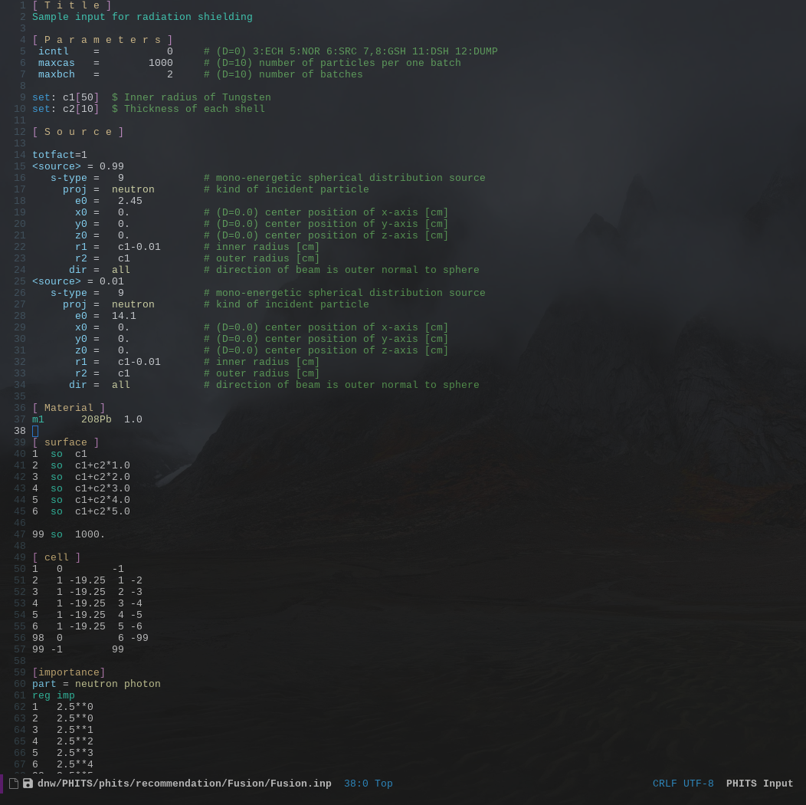

# phits-mode
Emacs major mode for editing PHITS input (.inp) files.

Currently only does syntax highlighting, but ought to expand to include automatic blockwise alignment of equals signs and tabular section entries, following the examples provided with the PHITS distribution.

Example:


# Install
To use this, in your init.el you must first set the load path to include the source, and then load the phits-mode.el file:
```
(add-to-list 'load-path "path/to/install")
(require 'phits-mode)
```
I hope to put this on MELPA at some point, preferrably in a little more complete form. 

In order to automatically enter `phits-mode` when opening a `.inp` file, add the following to init.el:
```
(add-to-list 'auto-mode-alist '("\\.inp\\'" . phits-mode))
```

